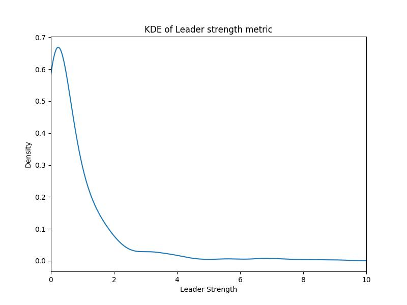
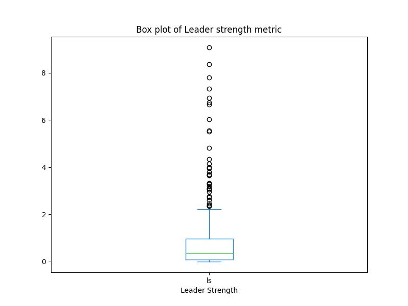

- [Users](https://github.com/gadilashashank/tds_p1/blob/main/code/1_fetch_users.py) and [Repositories](https://github.com/gadilashashank/tds_p1/blob/main/code/2_fetch_repos.py) were queried from GitHub GraphQL API, enabling efficient data retrieval in a single query (unlike the slower and inefficient REST API which requires multiple requests to gather the same information) using the [GitHubKit](https://github.com/yanyongyu/githubkit) library, which automatically handles pagination and API errors.
- On average, GitHub users in Dublin with over 50 followers take `471 days` to create their first repository and `3,557 days` for their latest, indicating a gradual start but sustained activity on the platform for nearly a decade, highlighting their long-term commitment to contributing to the open-source community.
- The Kernel Density Estimate and Box Plot of the `Leader Strength` metric (followers/1+following) shows most users exhibit low leader strength. Leading developers in Dublin should therefore consider mentoring newcomers to foster leadership growth and network expansion among them, thereby keeping the open-source ecosystem robust, inclusive and innovative.

